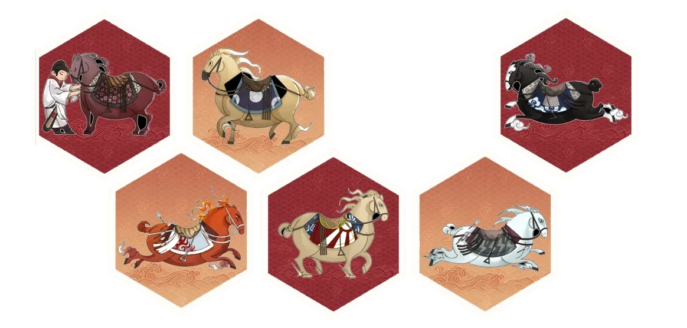
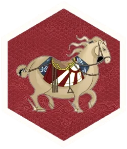

# 马上同心 · 文化信使 — 官方网站

> 中央民族大学教育学院「马上同心」社会实践团 ｜ 昭陵六骏马文化溯源与边疆宣讲实践
> 本目录是可直接部署的**静态网站**，无需构建、无需 Node、无外部依赖。

**线上地址**：<https://shichao194416.github.io/mashangtongxin/>
**源码仓库**：<https://github.com/shichao194416/mashangtongxin>（GitHub Pages，`main` 分支根目录）

---

## 一、这个网站相比原站做了什么

原站（`zhiniangmemory.my.canvasite.cn/dahsumio2kk`）是 Canva 导出的「图片翻页站」：整站只有 **1 个 `<section>`**，页面上的标题和正文全部是**矢量图形**而非文字，`document.body.innerText` 几乎是空的（只有页脚的「条款与支持/隐私政策」）。实测在浏览器里滚动，主内容区始终是空白。

重做后：

| 维度 | 原站 | 本站 |
|---|---|---|
| 文字 | 艺术字图形，无法选中/复制/搜索 | 全部为真实 HTML 文本，可选中、可复制、可被搜索引擎与读屏软件识别 |
| 导航 | 无（只能一直往下滚） | 顶部吸附导航 + 滚动高亮 + 移动端抽屉菜单 + 阅读进度条 |
| 内容检索 | 不可能 | 浏览器 Ctrl+F 可搜全文 |
| 手机 | 固定 1386px 画布，手机上只能横向拖动 | 响应式，390px 手机到桌面自适应 |
| 交互 | 仅 4 个外链游戏 | 六骏互动档案卡、背景分栏切换、实践时间轴、图片灯箱、视频弹窗、滚动进场动画 |
| 体积 | 数百张位图一次性加载 | 图片统一转 WebP，40MB → 4.8MB |
| 可维护 | 必须回到 Canva 改 | 改 `index.html` 即可 |

**原有内容 100% 保留**：8 个栏目、四大背景板块、六骏档案卡与赞语意象解读、IP 设计理念、8 集微课、4 款游戏、三组明信片、文创产品、传播矩阵、12 项项目优势、育人与示范价值、组织成员名单、团队荣誉与 Logo 说明、宣讲现场故事等，全部收录，未删减、未改写。

唯一新增的两处：
1. 把原站**首页的沉浸式游戏**「千载犹闻马蹄声」单独做成一个特色板块（原文案来自原站首页，此前未在任何栏目中体现）；
2. 用原站素材补了「实践掠影」图片墙与「孩子的回答卡」——素材均取自原站导出包。

---

## 二、目录结构

```
马上同心-网站/
├── index.html              ← 整站单页（10 个 section）
├── README.md               ← 本文件
└── assets/
    ├── css/style.css       ← 设计系统（朱红/黛蓝/宣纸/鎏金 + 响应式 + 双栏平衡）
    ├── js/main.js          ← 全部交互，原生 JS，无依赖
    ├── img/                ← 42 张 WebP（已压缩）
    │   ├── horses/         ← 六骏各自的 IP 形象（从六边形徽章图切出，透明底）
    │   └── members/        ← 9 张成员个人介绍海报
    └── video/              ← 2 个视频 + 2 张封面
```

---

## 三、本地预览

直接双击 `index.html` 即可打开（纯静态，无需服务器）。

如需用服务器预览（推荐，视频/相对路径更稳）：

```bash
# 在「马上同心-网站」目录下任选其一
python -m http.server 8000
npx serve .
```

然后访问 <http://localhost:8000>。

> 提示：本地改完 `main.js` 后用普通 `python -m http.server` 预览，浏览器可能缓存旧脚本，强制刷新（Ctrl+Shift+R）即可。

---

## 四、部署上线（参赛用）

这是一个**纯静态站点**，把整个 `马上同心-网站` 文件夹原样上传即可。

### 方案 A：Netlify Drop（最快）
1. 打开 <https://app.netlify.com/drop>
2. 把 `马上同心-网站` 文件夹**拖进去**
3. 几秒后得到 `https://xxxx.netlify.app` 公网地址，可直接写进参赛材料

### 方案 B：GitHub Pages
```bash
git init && git add . && git commit -m "马上同心 · 文化信使"
git remote add origin <你的仓库地址> && git push -u origin main
```
仓库 Settings → Pages → Source 选 `main` / `root`，几分钟后访问 `https://<用户名>.github.io/<仓库名>/`。

### 方案 C：Vercel / 校园服务器 / 任意虚拟主机
把文件夹内容丢进网站根目录即可，无需任何配置。

> 所有资源都是相对路径，放在子目录（如 `https://xxx.com/mashangtongxin/`）也能正常工作。

---

## 五、内容怎么改

全部内容集中在 `index.html`，用注释分好了块：

```
<!-- ==================== 首屏 ==================== -->
<!-- ==================== 数据条 ==================== -->
<!-- ==================== 探寻游戏 ==================== -->
<!-- ==================== 团队概览 ==================== -->
<!-- ==================== 实践背景 ==================== -->
<!-- ==================== 文化IP溯源 ==================== -->
<!-- ==================== 微课与游戏 ==================== -->
<!-- ==================== 成果展示 ==================== -->
<!-- ==================== 影像纪实 ==================== -->
<!-- ==================== 总结展望 ==================== -->
```

- **改文字**：直接改对应位置的文字。注意保留 `<p>`、`<h2>` 等标签，只动标签中间的内容。
- **首行缩进**：正文、导语（`.section__lead`）、卡片说明（`.card__text`）、时间轴（`.tl__text`）、
  引言（`.quote`）、图注（`figcaption`）统一 2 字缩进；纯标签类（药丸、徽标、日期、属性名等）不缩进，
  两者都在 `style.css` 的「prose」段集中声明。
- **换图片**：把新图放进 `assets/img/`，替换 `src="assets/img/xxx.webp"` 即可。建议先压到 1600px 以内、转成 WebP。
  多图并排请用 `ratio-row`（见 7.3），列宽按各图宽高比填写，否则会出现高度参差或留白。
- **六骏档案卡**：卡片文字在 HTML 里（`id="horsesGrid"`），**点开卡片后的「意象解读」**在 `<div id="horseTemplates" hidden>` 里，按 `data-tpl="0"…"5"` 对应 特勒骠→白蹄乌。
  每张卡的配图是 `assets/img/horses/<slug>.webp`，`main.js` 的 `HORSES[].art` 必须与卡片上的马名一致（六张分别是 `telebiao / qingzhui / shifachi / sa-luzi / quanmaogua / baitiwu`）。
  这六张透明底图是从 `six-hex.webp`（六边形徽章总图）里**按连通域自动切出来的**，若要换图，保持透明底 PNG/WebP 即可。
- **成员海报**：海报文件在 `assets/img/members/`，文件名用拼音（如 `ma-xueyi.webp`）。要换某人的海报，替换同名文件即可；要换名字或组别，改 HTML 里 `data-member="xxx"` 卡片的文字，**同时**改 `main.js` 里 `MEMBERS` 数组对应那一条的 `name` / `group`（两边必须一致）。
- **视频**：共两段，均已核对内容后归位 ——
  | 文件 | 内容 | 时长 / 分辨率 | 放置位置 |
  |---|---|---|---|
  | `assets/video/micro-lesson.mp4` | **微课视频**（第一课「什么是骏」，讲六骏名字为什么不像汉语） | 约 10 分钟 / 960×548 | 「微课与游戏」栏目内嵌播放器 |
  | `assets/video/fieldwork.mp4` | **影像纪实**（宣讲与田野调研纪实） | 约 5 分钟 / 1280×960 | 「影像纪实」栏目，点击弹窗播放 |

  > ⚠️ 原导出包把这两段都当作「影像」登记，站上最初也误把**微课**标成了「纪录片」。已按内容更正并把微课视频移进「微课与游戏」。
  > 导出包里每段视频都有多个分辨率档（`a30bede5` 1440×1080 / 94.6MB、`bbaa0193` 1280×960 / 76.2MB、`2a969cd9` 640×480 / 27.2MB……），
  > 当前取的是清晰度与体积的平衡档。**若上传体积吃紧**，可把 `fieldwork.mp4` 换成 `2a969cd9…mp4`（640×480，省约 49MB）。
- **游戏链接**：4 个 Netlify 链接已逐个打开核对 ——
  - 神奇六骏拼图 → `animated-eclair-f81f93`
  - 翻翻乐 → `incandescent-malasada-6bcb5f`
  - 消消乐 → `bucolic-gecko-4d2dc2`
  - 千载犹闻马蹄声（沉浸式叙事）→ `fanciful-madeleine-e60730`

> ⚠️ **姓名已按海报更正**：原导出包从艺术字识读得到的成员名单有笔误，已依据团队提供的个人海报与团队确认更正为 **罗怡欣**（原写「罗欣怡」）、**李世超**（原写「李超超」）、**杨雨璇**（指导教师，原写「杨雨薇」）。导出包 `全站文案.md` 第十一节本身就标注了「〔识读稿·请重点核对〕」，可对照海报复核其余姓名。

> ⚠️ **人数已更正**：原导出包文案写「共 8 名成员」，实际为 **9 名**（线下组 4 人 + 线上组 5 人），首页数据条与团队概览已同步改为 9。

> ⚠️ **行程已按团队更正**：原导出包 `全站文案.md` 内部**自相矛盾** —— 第 56/58 行写的真实路线是「从北京故宫出发，经西安碑林博物馆，最终抵达**张家川县**」，
> 媒体报道标题（第 291 行）与结尾文案（第 238/329 行）也都是「从故宫到**张家川**」；
> 但第 60/74/82 行却写成「深入**新疆伊犁**开展宣讲」，**团队并未到过伊犁**。
> 已把三处行程断言统一更正为**甘肃张家川**（网页上体现为「时代契机」「学校层面」两段正文 + 实践行程时间轴的「基层实践阶段」）。
> 「文化润疆」是新疆专项政策，与本项目目的地不符。
> **2026-10-05 更新（按团队修改任务书第 9 条）**：原「宏观政策」页签中作为客观背景保留的「文化润疆」整块内容已**全部删除**，
> 替换为与甘肃／西北民族地区相符的表述——正文改为「甘肃作为多民族聚居省份……推动各民族全方位嵌入」，
> 右侧卡片由「文化润疆」改为「民族团结进步创建在甘肃」（图标字「润」→「陇」，标签改为空间/文化/经济/社会/心理五个嵌入）。
> 全站已无「文化润疆」字样。经确认，「边疆」一词是团队自身的表述习惯，保持不动。

---

## 六、交互一览（可直接演示给评委）

| 交互 | 位置 | 说明 |
|---|---|---|
| 滚动高亮导航 | 全站 | 滚到哪个栏目，顶部导航对应项变红 |
| 阅读进度条 | 页面最顶端 | 细红金渐变条 |
| 移动端抽屉菜单 | 屏幕 < 900px | 右上角汉堡按钮 |
| 分栏切换 | 实践背景 | 5 个背景板块 Tab 切换，支持左右方向键 |
| **微课视频（内嵌播放）** | 微课与游戏 | 页面内直接播放，无需跳转；`preload="none"`，不点不下载 |
| 实践时间轴 | 实践背景 | 渐变竖线 + 节点 |
| **六骏互动档案卡** | 文化IP溯源 | 卡片右下角是**该匹马自己的 IP 形象**；点开 → 弹窗顶部同样换成对应那一匹的形象，展示石刻位置/毛色/战伤/赞语/自然元素/共同体精神 + 意象解读；**← → 方向键**或按钮切换，自动循环 |
| **成员个人海报** | 团队概览 | 点成员姓名 → 弹出该成员的个人介绍海报（含照片、座右铭、自我介绍）；**← → 方向键**或按钮在 9 位成员间切换，底部显示 `n / 9` |
| 图片灯箱 | 成果展示 / 影像纪实 | 点任意图放大，← → 切换，Esc 关闭（共 27 张） |
| 视频弹窗 | 影像纪实 | 点封面即播放，关闭自动停止并释放资源 |
| 回到顶部 | 右下角 | 滚动 700px 后出现 |
| 滚动进场动画 | 全站 | 已适配 `prefers-reduced-motion`（系统关闭动画时不播放） |

无障碍：语义化标签、`aria-*` 属性、键盘可达（Tab/Enter/方向键/Esc）、焦点管理与 `:focus-visible` 样式。

---

## 七、排版上的三个关键处理

### 7.1 双栏平衡（消除栏底空白）

**问题**：文字栏 + 图片栏并排时，图片按栏宽铺满后会远高于文字栏，文字下方就空出一大块（实测最严重的一处空 **728px**）。

**做法**（`style.css` 里的 `.split` / `.split__media` / `.plate`）：

- `.split`：双栏容器，`align-items: stretch`。
- `.split__media`：媒体列。里面的图片用 `flex: 1 1 0` —— **以 0 为基准参与布局，不撑高行**；于是行高由文字栏决定，图片再用 `object-fit: cover` 吃满剩余高度。图片与文字永远等高。
- `img.is-contain`：不想裁切的图（海报、贴纸、徽章）用等比完整显示 + 底色铺满，而不是留裸空白。
- `.plate` / `.grid--fill` / `.plate--fill`：多张高度不一的图并排时用统一画框，并吃满行高。
- `.feature`：整幅特征图铺满整行。

### 7.2 空隙的正确量法（重要，改版时按这个口径自查）

**只看盒子高度是查不出问题的。** 网格默认 `align-items: stretch`，两栏的盒子永远等高，
`盒子高度差` 恒为 0 —— 但内容可能只占了一半，另一半就是肉眼看到的空洞。
`scrollHeight` 也不行：它不会小于 `clientHeight`。

正确口径是**内容底边到盒子底边的距离**：

```js
function contentGap(box) {
  const br = box.getBoundingClientRect();
  let bottom = br.top;
  [...box.children].forEach(c => {
    const r = c.getBoundingClientRect();
    if (r.width || r.height) bottom = Math.max(bottom, r.bottom);
  });
  return Math.round(br.bottom - bottom);   // >= 60 才值得处理
}
```

而且**必须在多个视口宽度下量**（建议 920 / 1024 / 1200 / 1440 各测一次）——文字换行是非线性的，
1386px 下平衡的版式在 1024px 下可能空出 150px。

### 7.3 图片排版：不要用「底色框 + 等比缩放」

**踩过的坑**：曾经把图片放进固定比例的画框（`aspect-ratio` + `object-fit: contain` + 底色），
想靠底色把画框撑满来消除空白。结果适得其反 —— 生成的是「一个大色块里塞着一张小图」，
比原来的空白更难看。

**正确做法**：让图片的**自然宽高比**决定尺寸，然后用下面两种方式之一把版面填满：

1. **`ratio-row`（多图并排）**——把 grid 的列宽设成**各图宽高比的比例**，
   图片 `width:100%; height:auto`，则每张图的渲染高度自动相等：
   ```html
   <!-- six-hex 1164×557 (2.09)，特勒骠 251×296 (0.848) -->
   <div class="ratio-row" style="grid-template-columns:2.09fr 0.848fr">
     <figure><figcaption>…</figcaption></figure>
     <figure><figcaption>…</figcaption></figure>
   </div>
   ```
   既不裁切（cover）也不留底色（contain），高度还天然对齐。

2. **整幅特征图**（`.feature`，配图横跨整行）或 **CSS 双栏正文**（`.prose-cols`，文字铺满整行、单行不过长）。

**根本原因**：文字高度 ∝ 1/栏宽，图片高度 ∝ 栏宽。所以「文字 + 图片」左右并排时，
窄屏下文字必然比图片高一截，任何固定比例的图片都无法同时适配宽屏和窄屏。
**结论：文字与图片不要左右并排；要么整行文字 + 整行图，要么用 ratio-row 让图片彼此对齐。**

### 7.4 当前状态

- 版面级（开底空白）空隙：**全部为 0**。
- 仅剩的 3–4 处 60–93px 空隙都在**有边框的卡片内部**，且内容垂直居中，表现为约 30–46px 的对称内边距，
  属正常卡片留白（集中在「传播矩阵」三卡与「创作原则」卡）。

另外：首屏与「探寻游戏」板块的三个装饰性按钮已按要求删除。页面上保留的按钮全部是功能性入口
（3 个数字游戏 + 1 个沉浸式叙事游戏 + 六骏弹窗翻页 + 成员海报切换）。

### 7.5 字体体系：为什么用「隶 / 楷 / 宋」而不是黑体

初版全站用黑体（`Noto Sans SC` 起头的 sans 栈），观感偏现代、网页味重。现改为三体分工：

| 用途 | 变量 | 字体链 | 效果 |
|---|---|---|---|
| 首屏大标题 | `--font-display` | 隶书 LiSu / 华文隶书 STLiti → 行楷 → 楷体 | 蚕头燕尾，最重的古朴感 |
| 各级标题、栏目名、按钮、标签 | `--font-serif` | 楷体 KaiTi / 华文楷体 STKaiti → 宋体 | 书法笔意，取代原来的黑体 |
| 正文 | `--font-sans`（名字保留，内容已换成宋体栈） | 宋体 SimSun / 宋体-简 Songti SC → 仿宋 | 书籍/雕版感 |

要点与坑：

- **不加载任何外部字体**。全文只用操作系统自带中文字体，Windows（LiSu/KaiTi/SimSun）与 macOS（STLiti/STKaiti/Songti SC）各有一条链，
  两条都走空时回退通用 `serif`——即使字体缺失也只是换一种衬线体，**不会退回黑体**。
- **楷体/隶书/宋体在 Windows 上都没有真粗体**，`font-weight:700` 会触发浏览器合成加粗，笔画糊成一团。
  初版首屏那团「现代感」其实就是 132px 的宋体被合成了假粗。因此首屏标题显式 `font-weight:400`；
  其余标题字号较大，合成加粗反而像粗笔锋，予以保留。
- 另加了宣纸纤维底纹（内联 SVG `feTurbulence` 噪声 + `background-blend-mode:multiply`，零请求、零图片），
  实测纸面色阶浮动约 16 级——能感知、不脏。改强度只需要调 `--paper-grain` 里 rect 的 `opacity`。

### 7.6 音频：背景音乐与交互音效

站内有两套声音，**互相独立、各自可控**：

| | 背景音乐 | 交互音效 |
|---|---|---|
| 文件 | `assets/audio/bgm.m4a` | `assets/audio/*.mp3` |
| 内容 | 《古道尘远》（2 分 14 秒，循环播放） | 六骏各一段专属音 + 一段点击音 |
| 开关 | 左下角浮动按钮，点一下暂停、再点继续 | 页脚 `♪ 音效已开启` |
| 默认 | 开启 | 开启 |

设计上的几个取舍：

- **打开网页即播。** 浏览器的自动播放策略会拦截带声音的自动播放，硬来只会得到一个静音的播放器。
  所以这里用「两手准备」：载入时先直接 `play()` 一次（对已与本域产生过互动的访客、以及部分浏览器会成功）；
  被拦截时挂上**首次交互监听**（点击 / 按键 / 触摸 / 滚轮 / 滚动），用户一动就把音乐接上——实际效果等同于打开就放。
  音乐一旦真正响起就**解绑**这些监听，这样用户之后主动按暂停，不会因为再滚一下页面又被强行续播。
- **按钮是「暂停 / 继续」开关**，不是「开启 / 关闭」。播放中按钮显示 `♪ 暂停音乐`。
- **互相让位**：页面上任何 `<video>` 开始播放时背景音乐自动暂停，视频暂停/播完再淡回来。
- **`prefers-reduced-motion` 生效**：系统开了「减少动态效果」时交互音效默认静音，提示动画也停止。
- **点击音做了 110ms 去抖**，连点不会叠成一串；音量上音乐 0.32、音效 0.45、六骏音效 0.85。
- 音频文件名一律用 ASCII（`sa-luzi.mp3` 而不是 `飒露紫音效.mp3`），避免 URL 编码带来的兼容问题；
  命名与 `main.js` 里 `HORSES[]` 的 `art` 键一一对应（telebiao / qingzhui / shifachi / sa-luzi / quanmaogua / baitiwu）。

> ⚠️ **版权提示**：背景音乐《古道尘远》是团队提供的曲目文件。用于学生竞赛展示一般无碍，
> 但若站点将来要商用或公开发行，建议先确认曲目的授权情况，或换成明确可商用的曲目。交互音效由团队自行提供。

---

## 八、素材与版权

- 图片、视频、艺术字均来自原站导出包（`马上同心-Canva原站导出/`），仅做压缩、裁边与格式转换，未做二次创作改动。
- **清晰度**：原站对每张素材登记了最多三档清晰度（`SCREEN` / `SCREEN_2X` / `SCREEN_3X`），
  例如那张团队合影同时存在 `799×446` 与 `1552×867` 两个版本。
  本站已**统一取用每个素材的最高清版本**（28 张图因此升级，最大 9 倍），
  导出统一限制在长边 1800px、WebP 质量 84。
  > ⚠️ 从导出包取图时**不要按文件名顺序随便挑** —— 同一个素材的不同清晰度版本文件名完全不同（哈希），
  > 必须查 `06-页面数据/page-data.json` 里同一 `id` 下的 `files[]`，取面积最大的那个。
- **少数素材原站本身就只有低分辨率**，已按其原生尺寸限制显示尺寸、避免放大发虚：
  | 素材 | 原站最大 | 站内显示 |
  |---|---|---|
  | 团队 Logo | 107×107 | 导航 36px / 印章 74px / Logo 卡片 120px / 页脚 42px |
  | 公众号、小红书二维码 | 107×107 | 120px |
  > 使用这两个二维码时请用手机实测能否扫出；若偏难扫，建议向团队索取原始高清二维码替换（替换 `qr-wechat.webp` / `qr-xhs.webp` 同名文件即可）。
- **六骏单人 IP 形象**（`assets/img/horses/`）由 `six-hex.webp` 自动分离得到：按背景色做连通域分析取出 6 个六边形，用连通域本身作 alpha 蒙版，得到透明底图（各约 251×295，6 张合计约 140KB）。六边形总图 `six-hex.webp` 本身也已抠成透明底。
- **贴纸图**（`qban-sticker` / `qban-sticker-lg` / `team-02`）原图底部约 20% 是空蓝天，已裁掉，避免观感上的「下半截空着」。
- **透明留白**：原站不少素材是 PNG 抠图，画布里带大片透明边（如 `gugong-relief` 36%、`team-03` 42%、`team-07` 37%、`team-class` 43%、`logo-seal` 80%），
  在浅色容器里会显示成一块空白。已统一按 **alpha 包围盒**裁掉并补 3% 对称边距。
  > 改图时注意：这些素材是 **RGBA**，处理时**不要 `convert('RGB')`** —— 透明区会被压成黑色，既毁掉透明通道，也让后续按颜色找主体失效。
  > 裁完若图片宽高比变了，记得同步改用到它的 `ratio-row` 的 `fr` 值。
- **两张拓片 `six-paint-c` / `six-paint-d`** 原图的 alpha 最高只有 191（约 75% 不透明度），合成到浅色背景上几乎看不见。已把 alpha 提升 1.45 倍（只改可见度，不动画面内容）。
- **画廊排布**：四个图片墙都按「项目数 = 列数 × 整数行」排，**不留残缺行**
  （明信片 8 张 = 4×2，回答卡 3 张 = 3×1，实践纪实 8 张 = 4×2，文创与形象 4 张 = 4×1）。新增图片时请凑够整行，或同时调整列数。
  > 特别提醒：`.shot` 上**不要随便加 `span 2`（跨列）** —— 会让总格数 +1，4 列排下来末行就只剩 1 张、右边空 3 格。本项目两个画廊都踩过这个坑。
- **图片墙分组**：「影像纪实」页的实践掠影拆成**实践纪实（照片）**与**文创与形象（产品/插画）**两组，用 `.gallery-label` 小标题分隔 —— 照片和产品图混在一面墙里会显得很乱。
- **`<figure>` 默认外边距**：浏览器给 `<figure>` 的默认样式是 `margin: 1em 40px`。图片墙的格子是 `<figure class="shot">`，
  不清掉这个外边距，**每张图会比栅格窄 80px**（实测 271.5px 的列里图只有 191.5px）。
  已在 `.shot` 上写死 `margin: 0; width: 100%` —— 修这一处，全站 27 张图一次放大 ~45%。
  > 新增任何作为栅格项（grid/flex item）的 `<figure>` 时，**记得显式清 margin**。
- **照片行保持单行**：`#outlook` 那 4 张照片用 `.grid--photos`，在 620px 以上**始终保持 4 列不换行**（普通 `.grid--4` 在 1080px 就折成 2 列了）。
- **挂件图 `keychain.webp`**：原图 2400×1350 里挂件只占右侧（x 858–2254），左边一大片是透明留白，显示出来主体就偏右。
  已按 **alpha 通道**定位主体包围盒、裁掉多余留白并补 5% 对称边距，得到 1534×1292（宽高比 1.19，透明底保留），主体居中。
  > 改这张图时注意：`ratio-row` 的列宽比要跟着宽高比走（现为 `1.19fr 0.703fr`），否则两张图会不等高。
  > 另外它是 **RGBA** —— 处理时不要 `convert('RGB')`，否则透明区会被压成黑色。
- **成员个人海报**由团队提供（`成员海报.zip`），统一转为 1500px 内的 WebP（约 2.5MB / 9 张）。海报默认不随页面加载，鼠标悬停或键盘聚焦到成员卡片时才预取，点开才真正显示 —— 不拖慢首屏。
- 原站素材 `watermarked: false`，可正常用于参赛材料。
- 引用的四个互动游戏为团队自有 Netlify 项目，以外链方式接入，未复制其代码。
- 字体使用系统自带中文字体栈（思源宋体 / 苹方 / 微软雅黑等），**不加载任何外部字体**，离线可正常显示，也避免了字体版权问题。

---

## 九、兼容性

Chrome / Edge / Safari / Firefox 近两年版本，含 iOS Safari 15+、微信内置浏览器（用于公众号跳转）。
使用了 `IntersectionObserver`、CSS `backdrop-filter`、WebP —— 在过旧浏览器上会优雅降级（内容与导航仍可正常使用，仅失去部分动效）。

---

*Copyright © 2026 马上同心社会实践团 All Rights Reserved ｜ 故宫博物院 · 中央民族大学 · 同心共铸 · 神骏新传*
